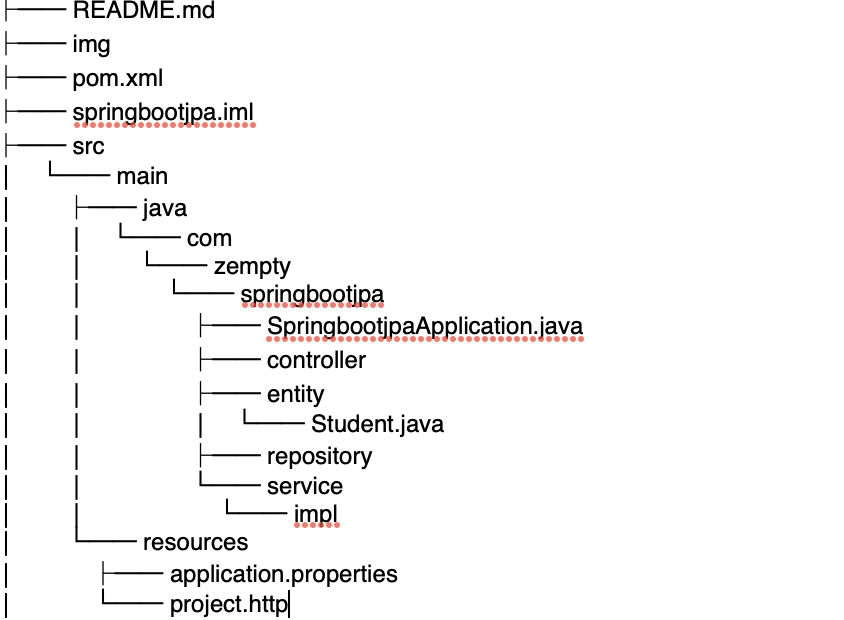

###  spring data jpa 的日常实战大总结

####  谈一谈 jpa

什么是 jpa ?
jpa 的全称是 Java Persistence API  , 中文的字面意思就是 java 的持久层 API , jpa 就是定义了一系列标准，让实体类和数据库中的表建立一个对应的关系，当我们在使用 java 操作实体类的时候能达到操作数据库中表的效果(不用 sql ,就可以达到效果），jpa 的实现思想即是 ORM （Object Relation Mapping），对象关系映射，用于在关系型数据库和业务实体对象之间作一个映射。

jpa 并不是一个框架，是一类框架的总称，持久层框架 Hibernate 是 jpa 的一个具体实现，本文要谈的 spring data jpa  又是在 Hibernate 的基础之上的封装实现。

当我们项目中使用 spring data jpa 的时候有时候你会发现并没有sql 语句，其实框架的底层已经帮我们实现了，我们只需要遵守规范使用就可以了，下面会详细谈到 spring data jpa 的各种规范细则。

使用 jpa 是可以解决一些我们写 sql 语句的烦恼，但是搞开发的如果真的连 sql 都不会写，还是很头疼的。当然本文并不是捧吹 spring data jpa , 另一个数据库层的框架 mybatis 也是十分优秀的框架，该框架是专注 sql 语句的，后续也会努力讲一讲同样优秀的mybatis ，有兴趣的关注一下，**微信公众号 「 zempty 笔记 」**。

####  spring data jpa常用的 jpa 的配置

项目的目录结构大致如下所示： 

README.md 详细记录了项目的各个知识点的总结说明；
pom.xml 引入了 spring data jpa 常用的 maven 依赖；
src 内有项目代码和配置文件 application.properties 和项目测试文件 project.http (该文件是提供用于接口快速测试，使用 idea 才可以使用)。
SpringbootjpaApplication.java 是主启动类，运行该类项目可以启动。
controller 包中提供了各种控制器类，对外提供各种测试 url。
entity 包中定义了各个实体类，可以类比是一个数据库中的各个表。
repository 包中定义了实体类的增删改查接口。
service 包中定义了业务层的各个需求接口。
impl 包中是对 service 包中的具体实现。

#### 类映射到数据库表的常用注解分析

####  类的继承分析

####  类之间的关系分析

#### 进一步剖析级联操作（cascade)

#### 使用 jpa  的关键字进行增删改查

####  jpa 使用 sql 增删改查

####  jpa 的分页操作

####  jpa 的条件查询

####  使用 jpa 的 Projection (投影映射功能）

####  继续学习，求一波关注