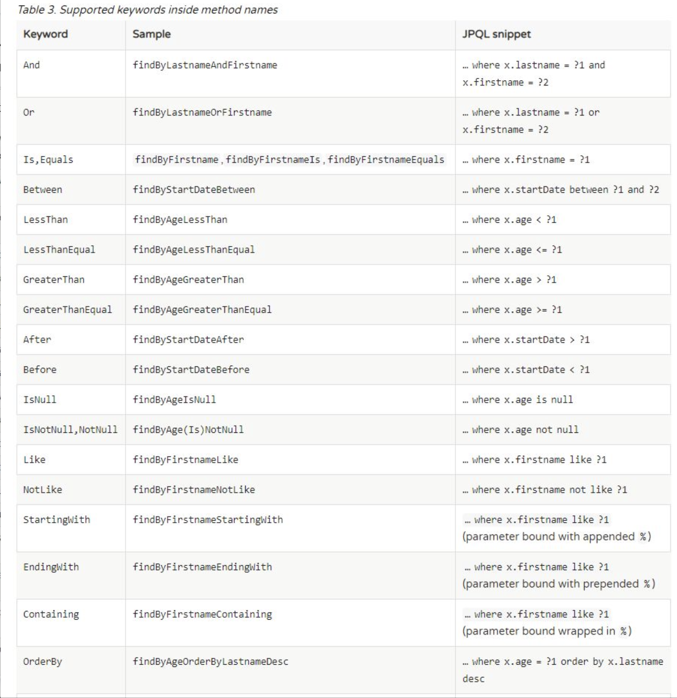
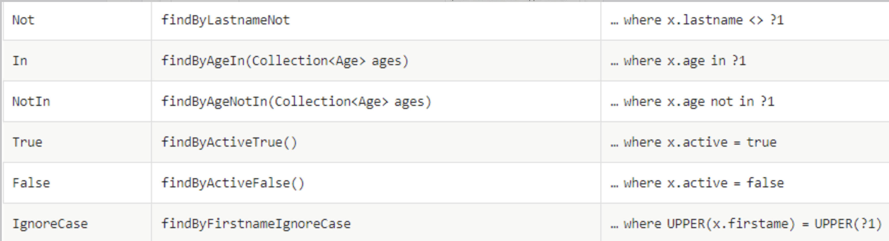

目录
----
   * [谈一谈 jpa](#谈一谈-jpa)
   * [spring data jpa常用的 jpa 的配置](#spring-data-jpa常用的-jpa-的配置)
   * [类映射到数据库表的常用注解分析](#类映射到数据库表的常用注解分析)
   * [类的继承分析](#类的继承分析)
   * [类之间的关系分析](#类之间的关系分析)
      * [@OneToOne](#onetoone)
      * [@OneToMany](#onetomany)
      * [@ManyToOne](#manytoone)
      * [@ManyToMany](#manytomany)
   * [进一步剖析级联操作（cascade)](#进一步剖析级联操作cascade)
      * [保存学生的时候，级联保存课桌](#保存学生的时候级联保存课桌)
      * [更新学生，级联更新教室数据](#更新学生级联更新教室数据)
      * [删除学生，把老师也删除了](#删除学生把老师也删除了)
      * [教室里有学生，如何删除教室](#教室里有学生如何删除教室)
      * [orphanRemoval 使用细则](#orphanremoval-使用细则)
   * [进一步剖析 mappedBy](#进一步剖析-mappedby)
      * [mappedBy 细节分析](#mappedby-细节分析)
   * [使用spring data jpa关键字进行增删改查](#使用spring-data-jpa关键字进行增删改查)
      * [如何定义 DAO 层](#如何定义-dao-层)
      * [使用关键字自定义查询](#使用关键字自定义查询)
   * [jpa 使用 sql 增删改查](#jpa-使用-sql-增删改查)
   * [使用 Sort 来对数据进行一个排序](#使用-sort-来对数据进行一个排序)
   * [jpa 的分页操作](#jpa-的分页操作)
   * [jpa  使用 Specification](#jpa--使用-specification)
      * [接口继承 JpaSpecificationExecutor](#接口继承-jpaspecificationexecutor)
      * [分析 Specification](#分析-specification)
   * [使用spring data  jpa 的 Projection (投影映射）](#使用spring-data--jpa-的-projection-投影映射)
      * [定义一个接口](#定义一个接口)
      * [使用自定义接口](#使用自定义接口)
   * [继续学习，求一波关注](#继续学习求一波关注)


###  谈一谈 jpa

什么是 jpa ?
jpa 的全称是 Java Persistence API  , 中文的字面意思就是 java 的持久层 API , jpa 就是定义了一系列标准，让实体类和数据库中的表建立一个对应的关系，当我们在使用 java 操作实体类的时候能达到操作数据库中表的效果(不用写sql ,就可以达到效果），jpa 的实现思想即是 ORM （Object Relation Mapping），对象关系映射，用于在关系型数据库和业务实体对象之间作一个映射。

jpa 并不是一个框架，是一类框架的总称，持久层框架 Hibernate 是 jpa 的一个具体实现，本文要谈的 spring data jpa  又是在 Hibernate 的基础之上的封装实现。

当我们项目中使用 spring data jpa 的时候，你会发现并没有 sql 语句，其实框架的底层已经帮我们实现了，我们只需要遵守规范使用就可以了，下面会详细谈到 spring data jpa 的各种规范细则。

使用 jpa 是可以解决一些我们写 sql 语句的烦恼，但是搞开发的如果 sql 写不好，还是很头疼的。当然本文并不是捧吹 spring data jpa , 另一个数据库层的框架 mybatis 也是十分优秀的框架，该框架是专注 sql 语句的，后续也会努力讲一讲同样优秀的mybatis ，有兴趣的关注一下，**微信公众号 「 zempty 笔记 」**。

### spring data jpa常用的 jpa 的配置

下面所有演示的代码均来自我个人 github 的 spring-data-jpa 仓库，仓库地址：[spring-data-jpa](https://github.com/kickcodeman/spring-data-jpa.git) ， 读者可以clone 下来运行本项目，验证下面讲的所有知识点。

下面把spring boot 项目关于 jpa 的常用配置 application.properties 配置如下：
```java
#项目端口的常用配置
server.port=8081

# 数据库连接的配置
spring.datasource.url=jdbc:mysql:///jpa?useSSL=false
spring.datasource.username=root
spring.datasource.password=zempty123
spring.datasource.driver-class-name=com.mysql.cj.jdbc.Driver

#数据库连接池的配置，hikari 连接池的配置
spring.datasource.hikari.idle-timeout=30000
spring.datasource.hikari.connection-timeout=10000
spring.datasource.hikari.maximum-pool-size=15
spring.datasource.hikari.minimum-idle=5
spring.datasource.hikari.auto-commit=true


#通过 jpa 自动生成数据库中的表
spring.jpa.hibernate.ddl-auto=update
spring.jpa.show-sql=true
spring.jpa.properties.hibernate.dialect=org.hibernate.dialect.MySQL5InnoDBDialect
```

下面重点分析一下 jpa 中的三个配置 ：
spring.jpa.hibernate.ddl-auto=update
该配置比较常用，当服务首次启动会在数据库中生成相应表，后续启动服务时如果实体类有增加属性会在数据中添加相应字段，原来数据仍在，该配置除了 update ，还有其他配置值，
 create  ：该值慎用，每次重启项目的时候都会删除表结构，重新生成，原来数据会丢失不见。
create-drop ：慎用，当项目关闭，数据库中的表会被删掉。
validate ： 验证数据库和实体类的属性是否匹配，不匹配将会报错。
综上：个人感觉还是使用 update 较为稳妥。

spring.jpa.show-sql=true
该配置当在执行数据库操作的时候会在控制台打印 sql 语句，方便我们检查排错等。

spring.jpa.properties.hibernate.dialect=org.hibernate.dialect.MySQL5InnoDBDialect
数据库的方言配置。


### 类映射到数据库表的常用注解分析

spring data jpa 提供了很多注解，下面我们把日常常用注解总结如下：

@Entity 是一个类注解，用来注解该类是一个实体类用来进行和数据库中的表建立关联关系，首次启动项目的时候，默认会在数据中生成一个同实体类相同名字的表（table），也可以通过注解中的 name 属性来修改表（table）名称， 如@Entity(name=“stu”) , 这样数据库中表的名称则是 stu 。 该注解十分重要，如果没有该注解首次启动项目的时候你会发现数据库没有生成对应的表。

@Table 注解也是一个类注解，该注解可以用来修改表的名字，该注解完全可以忽略掉不用，@Entity 注解已具备该注解的功能。 

@Id 类的属性注解，该注解表明该属性字段是一个主键，该属性必须具备，不可缺少。

@GeneratedValue 该注解通常和 @Id 主键注解一起使用，用来定义主键的呈现形式，该注解通常有多种使用策略，先总结如下：

1.   @GeneratedValue(strategy= GenerationType.IDENTITY) 该注解由数据库自动生成，主键自增型，在 mysql 数据库中使用最频繁，oracle 不支持。
2. @GeneratedValue(strategy= GenerationType.AUTO)  主键由程序控制，默认的主键生成策略，oracle 默认是序列化的方式，mysql 默认是主键自增的方式。
3. @GeneratedValue(strategy= GenerationType.SEQUENCE) 根据底层数据库的序列来生成主键，条件是数据库支持序列，Oracle支持，Mysql不支持。
4. @GeneratedValue(strategy= GenerationType.TABLE) 使用一个特定的数据库表格来保存主键，较少使用。

以上的主键生成策略当中，在数据库 mysql 当中 IDENTITY  和 AUTO 用的较多，二者当中 IDENTITY 用的多些，以下文章当中演示的 demo 主键均使用 @GeneratedValue(strategy= GenerationType.IDENTITY) 的生成策略。

@Column 是一个类的属性注解，该注解可以定义一个字段映射到数据库属性的具体特征，比如字段长度，映射到数据库时属性的具体名字等。

@Transient  是一个属性注解，该注解标注的字段不会被应射到数据库当中。

以上使用的注解是定义一个实体类的常用注解，通过上述的注解我们就可以通过实体类生成数据库中的表，实体类和表建立一个对应的关系，下面贴出一个实体类的定义 demo :

```java
package com.zempty.springbootjpa.entity;
import lombok.Getter;
import lombok.Setter;
import lombok.experimental.Accessors;

import javax.persistence.*;
import java.time.LocalDate;
import java.time.LocalDateTime;
import java.time.LocalTime;

@Setter
@Getter
@Accessors(chain = true)
@Entity(name = "stu")
//@Table
public class Student {

    @Id
    @GeneratedValue(strategy= GenerationType.TABLE)
    private long id;

    @Column(length = 100)
    private String name;

    @Transient
    private String test;

    private int age;

    private LocalTime onDuty;

    private LocalDate onPosition;

    private LocalDateTime birthdayTime;
}

```
该实体类中的 @Setter ,@Getter, @Accessors(chain =true) 均是 lombok 的注解，不了解的建议了解一下 lombok。
使用上述实体类的注解，当运行项目的时候就会在数据库中生成一个表名是 stu 的表。

###  类的继承分析

下面来研究一下类之间存在继承关系的时候，jpa 又是如何处理继承关系的呢？这个是很值得了解清楚的，这个搞明白了我们在使用 spring data jpa 的时候可能会事半功倍。

大致总结继承这块有这样三种情况：

1. 多类一表：多个类之间的属性相同，唯一的区别就是类型上的差异（类名不同），这个时候我们可以为这个共同属性的类建立一个父类，只让父类应射到数据库。
2. 多类多表：把多个类之间公有的属性提取出来放在它们公有的父类中，各个类之间可以定义自己特有的属性，子类和父类在数据库中都有相应的表和其对应。
3. 子类建表：把多个类之间公有的属性提取出来放在它们公有的父类中，各个类之间可以定义自己特有的属性，仅仅子类和数据库中的表建立关联关系，父类中的属性延续到每一个子类中，在数据库中每一个子类对应的表都有父类中定义的属性。

jpa 是如何处理上述的三种情况呢？ 通过一个注解：**@Inheritance** 该注解仅使用在父类当中，该注解有三种策略分别对应上述的三种情况,该部分可以参考本人github 仓库 [spring-data-jpa](https://github.com/kickcodeman/spring-data-jpa.git) 测试了解 ：

1.  **@Inheritance(strategy = InheritanceType.SINGLE_TABLE)** 该注解从字面来理解即可大致看出含义，只生成一个 table。现在先给出结论：该注解的使用场景是几个实体类的属性大致相同，没有什么区别，唯一区别的可能也就是类名了，这样的话我们可以考虑使用该注解，使用该注解的话我们多个实体类公用一个table ,该表由父类生成，父类中默认会生成一个 dtype 字段，用来表明该条数据是属于哪一个实体类的数据。详细使用可以参考项目包com.zempty.springbootjpa.entity.inheritance.single\_table 中的三个类，A1，B1, Group1 三个类的使用，类中的 Group1 是 A1 和 B1 的父类，A1 和 B1 中通常会使用如下的一个注解： @DiscriminatorValue 该注解只有一个 value 值用来标注在插入数据的时候 dtype 字段的值。在包 com.zempty.springbootjpa. inheritance. controller 中的 SingleController 有几个详细的测试案例，可以运行项目，测试几个接口，查看一下数据库查看使用细则。
2. **@Inheritance(strategy = InheritanceType.JOINED)** 该注解使用后，会生成多张表。现在先给出结论性总结如下：当有一个这样的需求，一些属性是多数类都有的，比如，username,password ... ,那么我们可以考虑把共有的属性给提取出来，单独做成一个表，类中特殊属性定义在各自的类中。 详细使用可以参项目包 com.zempty. springbootjpa. entity.inheritance.joined 中的三个类 A2, B2， Group2 ,三个类的使用, Group2 是 A2 和 B2 的父类，该案例将会把三个实体类都生成各自的表，当我们在添加 A2 或者 B2 数据进入数据库的时候 ，Group2 对用也会相应的添加一条数据， 子类中有一个注解 @PrimaryKeyJoinColumn 可以用来定义一个子类生成表的主键的名字，如果没有默认使用 id。  在包 com.zempty .springbootjpa. inheritance. controller 中的 JoinedController 中有几个测试案例，运行项目，即可查看感受一下使用细则。
3.  **@Inheritance(strategy = InheritanceType.TABLE_PER_CLASS)** 只有子类生成 table 。 现在先给出一个结论：父类中的属性是共有属性，父类不会生成 table ,子类定义自己特有的属性，子类生成的 table 会有父类中定义的属性字段。这里需要注意使用该注解的时候父类中的主键生成策略不可以是@GeneratedValue(strategy = GenerationType.IDENTITY) ，这里我定义成了 @GeneratedValue(strategy = GenerationType.AUTO) ，否则会报错。 详细使用可以参考包 com.zempty .springbootjpa..entity.inheritance.per\_table 中的三个类 A3,B3,Group3 的注解使用，Group3 是 A3 和 B3 的 父类，该案例，Group3 将不会被生成 table，但是其中的属性将会出现在每一个子类生成的 table 当中。在包 com.zempty .springbootjpa. inheritance. controller 中的 PerController 中有几个测试案例，运行项目，即可查看感受一下使用细则。 

还有一个注解在继承这里需要提到一下，那就是 **@MappedSuperclass** 这个注解，该注解也是使用在父类当中，父类不需要使用 @Entity 注解，该注解效果是同上面提到的第三种 @Inheritance(strategy = InheritanceType.TABLE_PER_CLASS)  使用类似，这里就不再过多解释了。

###  类之间的关系分析

在数据库当中表和表之间都是有一定的关联关系的，jpa 是如何在实体类之间建立和数据库表中类似的关联关系呢？

jpa 是通过一系列的注解来实现类之间的关联关系的，下面我们就来透彻的分析一下如何使用注解来表明类之间的关系，类之间的关系大致可以有一下几种情况：

1.  一对一的关系，jpa 使用的注解是 @OneToOne
2. 一对多的关系，jpa 使用的注解是 @OneToMany
3. 多对一的关系，jpa 使用的注解是 @ManyToOne
4. 多对多的关系，jpa 使用的注解是 @ManyToMany

在使用 jpa 的时候,这几个注解应该如何使用呢？下面结合实例进行展示说明，建议克隆远程的仓库的 [spring-data-jpa](https://github.com/kickcodeman/spring-data-jpa.git) ，案例代码都在仓库中可见。

现在针对上述的几种关系，举例如下：

有这样四个实体类：学生， 教室，老师，课桌

1. 一个学生通常只有一个课桌，一个课桌通常给一个学生使用，这里学生和课桌的关系就是互为 @OneToOne
2. 一个教室通常可以容纳很多的学生，教室到学生的关系就可以定义为 @OneToMany
3. 很多学生容纳在一个教室当中，学生到教室的关系可以定义为@ManyToOne
4. 一个学生可以有很多的老师，一个老师可以有很多的学生，这里学生和老师的关系就互为 @ManyToMany

在 java 的实体类当中应该如何描述上述关系呢？**Talk is simple ,now let me show code**:

####  @OneToOne
```java
学生实体类如下：

@Setter
@Getter
@Accessors(chain = true)
@Entity(name = "stu")
public class Student {

    @Id
    @GeneratedValue(strategy= GenerationType.IDENTITY)
    private long id;

    @Column(length = 100)
    private String name;


// 这里是定义学生和课桌的一对一的关系
    @OneToOne
// 下面的这个注解用来生成第三张表，来维护学生和课桌的关系
    @JoinTable( name = "stu_desk",joinColumns = @JoinColumn(name="student_id"),inverseJoinColumns = @JoinColumn(name="desk_id") )
    private Desk desk;

    @Transient
    private String test;

    private int age;

    private LocalTime onDuty;

    private LocalDate onPosition;

    private LocalDateTime birthdayTime;
}

```

课桌的实体类如下：

```java
@Setter
@Getter
@Accessors(chain = true)
@Entity
public class Desk {

    @Id
    @GeneratedValue(strategy = GenerationType.IDENTITY)
    private Integer id;

    private Integer deskNum;

    @OneToOne(mappedBy = "desk")
    private Student student;
}
```

上述的两个实体类展示了一对一的关联关系，实体类中互相关联彼此，这里有一点需要提出：**在一对一的关系维护中通常需要一个第三张表来维护这个关联关系，在 Student 类中定义了一个 @JoinTable 注解 ，该注解是用来生成第三张表的，如果没有该注解，就不会有第三张表，仅仅只是在 stu 表中生成一个外键**
**desk\_id 用来维护关系。** 在 Desk 类，@OneToOne 注解中有一个 mappedBy = “desk” 的属性，该字段说明  Desk 类放弃主键的维护，关于 **mappedBy** 这个属性下文也会重点谈到。

####  @OneToMany

教室类如下：
```java
import lombok.Getter;
import lombok.Setter;
import lombok.experimental.Accessors;

import javax.persistence.*;
import java.util.Set;

@Setter
@Getter
@Accessors(chain = true)
@Entity(name="class_room")
public class ClassRoom {


    @Id
    @GeneratedValue(strategy = GenerationType.IDENTITY)
    private Integer id;

    private String name;

    @OneToMany(mappedBy = "classRoom")
    private Set<Student> students;
}
```
使用 @OneToMany 的时候通常会紧跟 mappedBy 属性，因为一的一方通常是不需要维护主键的，主键在 @ManyToOne 的一方。

####  @ManyToOne 

学生类 Student 中关键新增代码片段如下：

```java
    @ManyToOne
    private ClassRoom classRoom;
```
一对多和多对一的关系维护中，通常在多的一方进行外键的维护，运行程序我们会发现在 stu 表中新增了一个 class\_room\_id 的外键。

####  @ManyToMany

Teacher  类如下所示：
```java
import lombok.Getter;
import lombok.Setter;
import lombok.experimental.Accessors;

import javax.persistence.*;
import java.util.Set;

@Setter
@Getter
@Accessors(chain = true)
@Entity
public class Teacher {

    @Id
    @GeneratedValue(strategy = GenerationType.IDENTITY)
    private Integer id;

    private String name;

    private String subject;

    @ManyToMany(mappedBy = "teachers")
    private Set<Student> students;
}
```
该 Teacher 类的 @ManyToMany 的属性使用了 mappedBy 表示该类放弃主键的维护,如果没有该属性会产生一个多余的表 teacher\_students 表，通常我们会在多对多的其中一方添加一个 mappedBy 属性，避免多余的表的产生 。

学生类 Student 关键代码如下所示：
```java
   @ManyToMany
    @JoinTable(name="stu_teacher",joinColumns = @JoinColumn(name ="stu_id"),inverseJoinColumns = @JoinColumn(name="teacher_id"))
   private Set<Teacher> teachers;
```
**在多对多的关系维护中，通常是需要第三种表去维护彼此的关系，这里使用了 @JoinTable 注解来定义第三种表的表名，属性字段等等。**

小结： 类和类之间的关系在 jpa 中很重要，务必要搞清楚，以上展示代码可参考个人仓库  [spring-data-jpa](https://github.com/kickcodeman/spring-data-jpa.git)，可以 clone 下来，详细的分析一下应该如何使用上面所述的四种关系。

### 进一步剖析级联操作（cascade)

**什么是 jpa 的级联操作？**

这里级联可能不好理解，你可以理解成关联，我在操作 Student 类的增删改查的时候， Student 类的关联类会受到相应的影响。

在使用 spring data jpa 进行增删改查的时候一定要弄清彼此的级联关系，这很重要，很重要，很重要。。。

**级联应该怎么使用呢？**

在上面讲解的四种类之间的关系的时候，四个关系注解 @OneToMany , @ManyToOne, @OneToOne , @ManyToMany 中都有一个属性叫 cascade 该属性值是一个 CascadeType 的数组，下面来重点解释和分析各种 CascadeType, 没有使用 cascade ,默认是 default, 就是不存在级联。

1.  CascadeType.PERSIST 该级联是级联保存。
2. CascadeType.MERGE  该级联是级联更新
3. CascadeType.REMOVE 该级联是级联删除
4. CascadeType.REFRESH 该级联是级联刷新(不常用）
5. CascadeType.DETACH  该级联是级联托管（不常用）
6. CascadeType.ALL 具有上述五个级联的功能

下面我们用实例来说明上述的常用级联（保存，更新，删除）的使用情况: **以下展示的案例代码均在 [spring-data-jpa](https://github.com/kickcodeman/spring-data-jpa.git) 可见，如果你使用的是 idea 运行项目，resource 文件夹下面有 test.http 测试接口文件，里面有案例展示的所有接口可以运行测试**。

####  保存学生的时候，级联保存课桌

Student 级联设置关键代码如下所示：

```java
 // 设置级联保存，保存学生的时候也会保存课桌
    @OneToOne(cascade = CascadeType.PERSIST)
    @JoinTable( name = "stu_desk",joinColumns = @JoinColumn(name="student_id"),inverseJoinColumns = @JoinColumn(name="desk_id") )
    private Desk desk;
```

测试代码如下：
```java
  @PostMapping("/save_student")
    public Student saveStudent() {
        Student student = new Student()
                .setAge(19)
                .setName("zempty");

        Desk desk = new Desk()
                .setDeskNum(10);
// 学生分配座位，如果设置了级联保存，保存学生的时候也会保存座位，如果没设置级联保存，添加课桌会报错
        student.setDesk(desk);
        return studentRepository.save(student);
    }
```
从上面的代码可以看到在保存 Student 的时候，Desk 也保存到了数据库，这就是级联保存的妙用。

####  更新学生，级联更新教室数据

Student 类的关键代码如下：
```java
    //设置级联更新，在跟新 student 的时候如果更新 classroom , 会级联更新 classroom
    @ManyToOne(cascade = CascadeType.MERGE)
    private ClassRoom classRoom;

```
测试代码如下：
```java
   @PutMapping("/update_student/{id}")
    public Student updateStudent(@PathVariable("id") Integer id) {
        Optional<Student> optional = studentRepository.findById(id);
        optional.ifPresent(student->{
            student.setName("zempty_zhao");

            ClassRoom room = student.getClassRoom();
            room.setName("IT 666999");
            studentRepository.save(student);
        });
        return optional.get();
    }
```
该案例展示了在跟新 Student  的时候顺便更新了 ClassRoom 。

#### 删除学生，把老师也删除了 

学生的关键代码如下所示：
```java
    //设置级联删除操作，这是多对对的级联删除，
    // 删除学生的同时会删除关联的老师，如果老师还有关联其他的学生，就会报错，除非老师类也要级联删除，这个删除是要慎重的
    @ManyToMany(cascade = {CascadeType.REMOVE})
    @JoinTable(name="stu_teacher",joinColumns = @JoinColumn(name = "stu_id"),inverseJoinColumns = @JoinColumn(name="teacher_id"))
    private Set<Teacher> teachers;
```

 测试代码如下：

    @DeleteMapping("/delete_student/{id}")
    public void deleteStudent(@PathVariable("id") Integer id) {
        Optional<Student> optional = studentRepository.findById(id);
        optional.ifPresent(student -> {
            studentRepository.delete(student);
        });
    }

运行测试，你会发现删除学生的同时把老师也给删除了，这个很容易出问题，可能会出现如下的两个问题：
1. 如果该老师还有其他关联的学生这里会报错，请注意。
2. 如果老师那里也配置了级联删除，删除老师的同时，老师的关联学生都会连带删除。
如果不清楚级联删除的功能，可能会造成很严重的后果，建议读者一定反复测试该案例弄清楚级联删除的使用。

####  教室里有学生，如何删除教室

如果数据库中教室和学生存在绑定关系，如果删除这个教室就会出现问题，无法正常删除因为存在外键，如何解决这个问题呢？

**当删除数据的时候，如果该数据存在外键是无法直接删除的**，这是在日常使用当中很容易遇到的一个问题，现在就这个问题给出一些解决方案：
 
ClassRoom 核心代码如下所示：
```java
    @OneToMany(mappedBy = "classRoom")
    @JsonIgnore
    private Set<Student> students;
```
ClassRoom 类和学生的关系是一对多，我们使用了 mappedBy 属性，表示该类放弃主键的维护，由学生类来进行主键的维护，直接删除学生是无法清掉主键的，必须找到该教师的所有学生，把学生的教师置空，然后在删除教师，关键性代码如下所示：
```java
   @DeleteMapping("delete_room/{id}")
    public void deleteClassRoom(@PathVariable("id") Integer id) {
        Optional<ClassRoom> optional= classRoomRepository.findById(id);
        optional.ifPresent(classRoom ->{
            // 先找到所有的学生，把教室置空，然后删除教室
            Set<Student> students = classRoom.getStudents();
            students.forEach(student -> student.setClassRoom(null));
            classRoomRepository.delete(classRoom);
        });;
    }
```
下面讲一下另一种解决办法，该方法不推荐：
教室类在@OneToMany 中添加一个属性 orphanRemoval = true   
教师类关键代码如下所示：
```java
   @OneToMany(mappedBy = "classRoom",orphanRemoval = true)
    @JsonIgnore
    private Set<Student> students;
```
下面改掉删除的测试代码 ，注释掉学生部分代码，直接删除教室，如下所示：
```java
 @DeleteMapping("delete_room/{id}")
    public void deleteClassRoom(@PathVariable("id") Integer id) {
        Optional<ClassRoom> optional= classRoomRepository.findById(id);
        optional.ifPresent(classRoom ->{
            // 先找到所有的学生，把教室置空，然后删除教室
//            Set<Student> students = classRoom.getStudents();
//            students.forEach(student -> student.setClassRoom(null));
            classRoomRepository.delete(classRoom);
        });;
    }
```
这个删除效果是可以把教室删除的，但是你你查询数据库的时候你会发现，教室内的学生都不见了，学生也跟着一起删除了，这个使用时一定要慎重的。

####  orphanRemoval 使用细则

orphanRemoval 这个属性只存在两类关系注解中 @OneToOne 和 @OneToMany 

jpa 为什么把这个注解仅仅只放在这两个关系类注解中呢？
个人分析是使用 @OneToOne 和 @OneToMany 的实体类是存在外键的，操作存在外键的类，尤其是删除的时候就会很头痛，于是就提供了这样的一个属性，来消除外键带来的烦恼。

在使用该属性的时候，也就是该属性设置成 true 的时候一定要慎重，从上面的例子可以看出来，当我在删除教室的时候，教室里的学生也都被删除了，该属性会有一个级联的效果。

### 进一步剖析 mappedBy

在 jpa 中的关系属性中，mappedBy 是很重要的一个属性存在，做为一个使用者我们一定要清楚 mappedBy 的使用细则，下面根据个人的使用经验总结如下：
1. 当一个实体类使用了 mappedBy 属性，是可以避免多余的表生成的，如果没有使用该属性，程序运行后在数据库会多生成一个关系表。
2. 当一个实体类使用了 mappedBy 属性，表示该类放弃主键的维护，该类生成的表中不存放和它关联类的外键。

#### mappedBy 细节分析

使用 mappedBy 的一方是放弃主键的维护的，当在使用 mappedBy 的一方进行级联操作的时候有些细节你应该知道：

1. 通常 mappedBy 在处理级联删除的时候使用 orphanRemoval 属性就好，当然在@ManyToMany 这个注解当中是没有 orphanRemoval 这个属性的，还是需要使用自己的级联删除属性的。
2. 级联保存和级联更新的时候你需要知道在保存和更新关联数据的时候是没有关联到外键的，你需要借助关联类去维护外键，下面看代码展示：

教室类级联保存学生，教室类关键代码如下：
```java
   @OneToMany(mappedBy = "classRoom",cascade = CascadeType.PERSIST)
    @JsonIgnore
    private Set<Student> students;
```
测试代码：
```java
   @PostMapping("/save_room")
    public ClassRoom saveClassRoom() {
        ClassRoom room = new ClassRoom()
                .setName("IT 教室");
        Set<Student> students = new HashSet<>();
        Student student = new Student().setName("test123");
        students.add(student);
        room.setStudents(students);
        return classRoomRepository.save(room);
    }
```
以上这种处理方式是可以在保存教室的时候，把学生也保存到数据库当中，但是**因为教室类不进行外键的维护，虽然学生类保存成功，但是是失败的，因为它们之间的关系并没有建立起来，查看学生表的新增数据我们会发现新增的学生并没有教室的外键存在**。

**我们如何有效的级联保存呢？**
我们必须弄清楚谁是维护彼此关系的，上面的教室使用了 mappedBy 属性放弃了主键的维护，因此我们需要借助学生类来维护彼此的关系，我们在测试代码中需要在学生类中把教室给设置进去，这样问题就解决了：
改进测试代码：

    @PostMapping("/save_room")
    public ClassRoom saveClassRoom() {
        ClassRoom room = new ClassRoom()
                .setName("IT 教室");
        Set<Student> students = new HashSet<>();
        Student stu = new Student().setName("test123");
        students.add(stu);
        //改进代码，学生类维护关系，把教室设置到每一个学生当中
        students.forEach(student -> student.setClassRoom(room));
        room.setStudents(students);
        return classRoomRepository.save(room);
    }

上面的这个案例开发者很容易忽略，在此希望该案例能够帮到你。

### 使用spring data jpa关键字进行增删改查

在使用 spring data jpa 进行数据库的增删改查的时候，基本上我们无需写 sql 语句的，但是我们必须要遵守它的规则，下面就来聊一聊：

####  如何定义 DAO 层

spring data jpa 的数据层，我们只需要定义一个接口继承 JpaRepository 就好，
JpaRepository 接口中定义了丰富的查询方法供我们使用，足以供我们进行增删改查的工作，参考代码如下：

定义一个 Student 的 dao 层，这样我们的增删改查就已经有了
```java
public interface StudentRepository extends JpaRepository<Student,Integer> {
}
```
在 spring boot 项目中在 dao 层我们不需要写 @Repository 注解 ，我们在使用的时候直接注入使用就好，这里需要说明一点， 我们在更新数据的时候，可以先查询，然后更改属性，使用 save 方法保存就好。

#### 使用关键字自定义查询

我们可以使用 jpa 提供的 find  和 get 关键字完成常规的查询操作,使用 delete 关键字完成删除，使用 count 关键字完成统计等

下面看下面的一段代码展示：
```java
public interface StudentRepository extends JpaRepository<Student,Integer> {


    // 查询数据库中指定名字的学生
    List<Student> findByName(String name);

    // 根据名字和年龄查询学生
    List<Student> getByNameAndAge(String name, Integer age);

    //删除指定名字的学生
    Long deleteByName(String name);

    // 统计指定名字学生的数量
    Long countByName(String name);

}
```
find 测试案例：
```java
  //通过find 关键字进行名字查询
    @GetMapping("/find/{name}")
    public List<Student> findStudentsByName(@PathVariable("name") String name) {
        return studentRepository.findByName(name);
    }
```
get 关键字测试：
   //根据名字和年龄进行查询
```java
    @GetMapping("/get/{name}/{age}")
    public List<Student> getStudentByNameAndAge(@PathVariable("name") String name,@PathVariable("age") Integer age) {
        return studentRepository.getByNameAndAge(name, age);
    }
```
delete 测试：
```java
   //根据名字进行删除操作
    @DeleteMapping("/delete/{name}")
    //删除的时候一定要添加事务注解
    @Transactional
    public Long deleteStudentByName(@PathVariable("name") String name) {
        return studentRepository.deleteByName(name);
    }
```
count 关键字统计：
  //统计指定名字学生的数量
```java
    @GetMapping("/count/{name}")
    public Long countStudentByName(@PathVariable("name") String name) {
        return studentRepository.countByName(name);
    }
```
可以看到上述使用 find关键字加上By 和要查询的字段，这样一条查询语句就写好了，可以说相当的方便，下面附上通过关键字查询的图表，方便我们使用关键字查询：




基本上我们操作数据的时候，参考上述表格的关键字就可以解决了。

###  jpa 使用 sql 增删改查

有时候我们不习惯使用上述的关键字去操作数据，就是喜欢写 sql , spring data jpa 也是支持写 sql 语句的，如何使用呢？ 案例代码如下所示：

```java
public interface ClassRoomRepository extends JpaRepository<ClassRoom,Integer> {

    //使用的 JPQL 的 sql 形式 from 后面是类名
    // ?1 代表是的是方法中的第一个参数
    @Query("select s from ClassRoom s where s.name =?1")
    List<ClassRoom> findClassRoom1(String name);

    //这是使用正常的 sql 语句去查询
    // :name 是通过 @Param 注解去确定的
    @Query(nativeQuery = true,value = "select * from class_room c where c.name =:name")
    List<ClassRoom> findClassRoom2(@Param("name")String name);
}

```
参考上述的案例我们可以发现，**sql 有两种呈现形式**：
1. JPQL 形式的 sql 语句，from 后面是以类名呈现的。
2. 原生的 sql 语句，需要使用 nativeQuery = true 指定使用原生 sql

**sql 中的参数传递也有两种形式**：
1. 使用问号 ?，紧跟数字序列，数字序列从1 开始，如 ?1 接收第一个方法参数的值。
2. 使用冒号：，紧跟参数名，参数名是通过@Param 注解来确定。

###  使用 Sort 来对数据进行一个排序

spring data jpa 提供了一个 Sort 类来进行分类排序，下面通过代码来说明 Sort 的使用：
```java
public interface TeacherRepositoty extends JpaRepository<Teacher,Integer> {

    // 正常使用，只是多加了一个 sort 参数而已
    @Query("select t from Teacher t where t.subject = ?1")
    List<Teacher> getTeachers(String subject, Sort sort);
}

```
上述代码正常的写 sql 语句，只是多加了一个 Sort 参数而已，如何实例化 Sort 应该是我们关注的重点，现在看测试代码如下：
```java
  @GetMapping("/sort/{subject}")
    public List<Teacher> getTeachers(@PathVariable("subject") String subject) {
        // 第一种方法实例化出 Sort 类，根据年龄进行升序排列
        Sort sort1 = Sort.by(Sort.Direction.ASC, "age");

        //定义多个字段的排序
        Sort sort2 = Sort.by(Sort.Direction.DESC, "id", "age");

        // 通过实例化 Sort.Order 来排序多个字段
        List<Sort.Order> orders = new ArrayList<>();
        Sort.Order order1 = new Sort.Order(Sort.Direction.DESC, "id");
        Sort.Order order2 = new Sort.Order(Sort.Direction.DESC, "age");
        orders.add(order1);
        orders.add(order2);
        Sort sort3 = Sort.by(orders);

        //可以传不同的 sort1,2,3 去测试效果
        return teacherRepositoty.getTeachers(subject, sort1);
    }
```
Sort 是用来用来给字段排序的，可以根据一个字段进行排序，也可以给多个字段设置排序规则，但是个人之见使用Sort 对一个字段排序就好。

Sort 类的实例化可以通过 Sort 的 by 静态方法实例化就好，这里就不一一列举了，参考上述案例就好。

###  jpa 的分页操作

数据多的时候就需要分页，spring data jpa 对分页提供了很好的支持，下面通过一个 demo 来展示如何使用分页：
```java
public interface TeacherRepositoty extends JpaRepository<Teacher,Integer> {

    //正常使用，只是多加了一个 Pageable 参数而已
    @Query("select t from Teacher t where t.subject = :subject")
    Page<Teacher> getPage(@Param("subject") String subject, Pageable pageable);
}
```
按照正常的查询步骤，多加一个 Pageable 的参数而已，如何获取 Pageable 呢？

Pageable 是一个接口类，它的实现类是 PageRequest ,下面就通过测试代码来研究一下如何来实例化 PageRequest:
```java
    @GetMapping("page/{subject}")
    public Page<Teacher> getPage(@PathVariable("subject") String subject) {
        // 第一种方法实例化 Pageable
        Pageable pageable1 = PageRequest.of(1, 2);

        //第二种实例化 Pageable
        Sort sort = Sort.by(Sort.Direction.ASC, "age");
        Pageable pageable2 = PageRequest.of(1, 2, sort);

        //第三种实例化 Pageable
        Pageable pageable3 = PageRequest.of(1, 2, Sort.Direction.DESC, "age");


        //可以传入不同的 Pageable,测试效果
        Page page = teacherRepositoty.getPage(subject, pageable3);
        System.out.println(page.getTotalElements());
        System.out.println(page.getTotalPages());
        System.out.println(page.hasNext());
        System.out.println(page.hasPrevious());
        System.out.println(page.getNumberOfElements());
        System.out.println(page.getSize());
        return page;
    }
```
PageRequest 一共有三个可以实例化的静态方法：
1. public static PageRequest of(int page, int size) 
2. public static PageRequest of(int page, int size, Sort sort) 分页的同时还可以针对分页后的结果进行一个排序。
3.  public static PageRequest of(int page, int size, Direction direction, String... properties) 直接针对字段进行排序。

###  jpa  使用 Specification

上面提供的各种 jpa 的使用方法已经相当的丰富了，可以根据自己的需求去选择，下面我们在来分析另一种 spring data jpa 查询数据的方法，使用 Specification 去处理数据：

#### 接口继承 JpaSpecificationExecutor 
```java
public interface TeacherRepositoty extends JpaRepository<Teacher,Integer> , JpaSpecificationExecutor {
}
```
TeacherRepository 除了继承 JpaRepository 以外，还继承了 JpaSpecificationExecutor  接口，下面就来详细分析一下该接口，JpaSpecificationExecutor  提供了如下的几个方法供我们使用：
```java
public interface JpaSpecificationExecutor<T> {

    Optional<T> findOne(@Nullable Specification<T> var1);

    List<T> findAll(@Nullable Specification<T> var1);

    Page<T> findAll(@Nullable Specification<T> var1, Pageable var2);

    List<T> findAll(@Nullable Specification<T> var1, Sort var2);

    long count(@Nullable Specification<T> var1);

}
```
该接口一共有五个方法，还提供了排序，分页的功能，分析方法的参数我们会发现方法中的参数 Specification 是我们使用的一个门槛，下面来具体分析如何实例化 Specification 。

####  分析 Specification

Specification 是一个函数式接口，里面有一个抽象的方法：
```java
 Predicate toPredicate(Root<T> var1, CriteriaQuery<?> var2, CriteriaBuilder var3);
```
实现该方法我们不需要弄清楚 Predicate , Root , CriteriaQuery 和 CriteriaBuilder 四个类的使用规则：
 
现在有这样的一条 sql 语句 ： **select  \*  from teacher where age > 20**

1. Predicate 是用来建立 where 后的查寻条件的相当于上述sql语句的 age > 20。
2. Root 使用来定位具体的查询字段，比如 root.get(“age”) ,定位 age字段，
3. CriteriaBuilder是用来构建一个字段的范围，相当于 > ,= ,<，and …. 等等 
4. CriteriaQuery 可以用来构建整个 sql 语句，可以指定sql 语句中的 select 后的查询字段，也可以拼接 where ， groupby 和 having 等复杂语句。

上面的分析是十分抽象的，关于这四个类的详细使用，自己也可以上网查询多参考几个案例分析即可。

演示案例：
```java
   @GetMapping("/specification/{subject}")
    public List<Teacher> specification(@PathVariable("subject") String subject) {
        //实例化 Specification 类
        Specification specification = ((root, criteriaQuery, criteriaBuilder) -> {
            // 构建查询条件
            Predicate predicate = criteriaBuilder.equal(root.get("subject"), subject);
            // 使用 and 连接上一个条件
            predicate = criteriaBuilder.and(predicate, criteriaBuilder.greaterThan(root.get("age"), 21));
            return predicate;
        });
        //使用查询
        return teacherRepositoty.findAll(specification);
    }
```
这里我演示了一个很简单的查询demo，希望可以帮助你打开使用 Specification 的大门。

### 使用spring data  jpa 的 Projection (投影映射）

该部分是很有趣的一部分，简单容易操作， Projection 是要解决什么问题呢？

当我们使用 spring data jpa 查询数据的时候，有时候不需要返回所有字段的数据，我们只需要个别字段数据，这样使用 Projection 也是不错的选择，下面讲一下使用细则。

####  定义一个接口

现在的需求是我只需要 Teacher 类对应的表 teacher 中的 name 和 age 的数据，其他数据不需要。 定义一个如下的接口：
```java
public interface TeacherProjection {

    String getName();

    Integer getAge();

    @Value("#{target.name +' and age is' + target.age}")
    String getTotal();
}
```
**接口中的方法以 get 开头 + 属性名，属性名首字母大写， 例如 getName(), 也可以通过 @Value 注解中使用 target.属性名获取属性，也可以把多个属性值拼接成一个字符串。**

####  使用自定义接口

定义好一个接口后，在查询方法中指定返回接口类型的数据即可，参考代码如下：
```java
public interface TeacherRepositoty extends JpaRepository<Teacher,Integer>, JpaSpecificationExecutor {

   // 返回 TeacherProjection 接口类型的数据
    @Query("select t from Teacher t ")
    List<TeacherProjection> getTeacherNameAndAge();
}
```
测试结果：
```java
  @GetMapping("/projection")
    public List<TeacherProjection> projection() {
       // 返回指定字段的数据
        List<TeacherProjection> projections = teacherRepositoty.getTeacherNameAndAge();

       // 打印字段值
        projections.forEach(teacherProjection -> {
            System.out.println(teacherProjection.getAge());
            System.out.println(teacherProjection.getName());
            System.out.println(teacherProjection.getTotal());
        });
        return projections;
    }
```
运行测试，查看结果我们会发现，我们仅仅只是拿到 name 和 age 的字段值而已。

### 继续学习，求一波关注

这篇文章很长，也写了很久，文中表达的观点个人都经过反复的验证，力求确保准确，如果文中表达有错误之处，欢迎指正，本文案例代码来自本人 github 仓库  [spring-data-jpa](https://github.com/kickcodeman/spring-data-jpa.git)  ，可以 clone 下来运行测试即可。

路漫漫其修远矣，学习的路还很长，期待和你做朋友，一起探讨，一起进步。

<p align="center">
  
</p>

